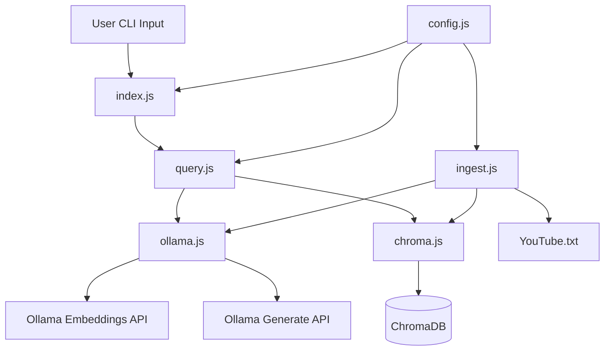

# Simple RAG CLI

A minimal, production-ready Retrieval-Augmented Generation (RAG) application built with Node.js, Ollama, and ChromaDB. This CLI tool allows you to ask questions about your documents using local LLMs and embeddings.

## Overview

This RAG application:
- Ingests documents and generates embeddings using Ollama's `mxbai-embed-large` model
- Stores embeddings in ChromaDB for efficient similarity search
- Answers questions using retrieved context and Ollama's `gemma3` LLM
- Runs entirely locally - no external API calls required

## Architecture



**Alternative Text Diagram** (for markdown previewers without Mermaid support):

```
┌─────────────┐
│ User Input  │
└──────┬──────┘
       │
       ▼
┌─────────────┐
│  index.js   │◄────┐
└──────┬──────┘     │
       │            │
       ▼            │
┌─────────────┐     │
│  query.js   │     │
└──┬──────┬───┘     │
   │      │         │
   │      │         │
   ▼      ▼         │
┌────-─┐ ┌-─────┐   │
│ollama│ │chroma│   │
└──┬─--┘ └─-─┬──┘   │
   │         │      │
   │         ▼      │
   │   ┌─────────┐  │
   │   │ChromaDB │  │
   │   └─────────┘  │
   │                │
   ▼                │
┌──────────────┐    │
│Ollama APIs   │    │
│(Embed/Gen)   │    │
└──────────────┘    │
                    │
┌─────────────┐     │
│  ingest.js  │─────┘
└──┬──────┬───┘
   │      │
   ▼      ▼
┌─────-┐ ┌─────-┐
│ollama│ │chroma│
└─────-┘ └─────-┘
   │
   ▼
┌──────────────┐
│  YouTube.txt │
└──────────────┘
```

### Data Flow

1. **Ingestion Phase**:
   - Documents are loaded from `data/YouTube.txt`
   - Text is chunked into overlapping segments (1000 chars with 200 char overlap)
   - Each chunk is embedded using `mxbai-embed-large`
   - Embeddings are stored in ChromaDB with document text

2. **Query Phase**:
   - User question is embedded using the same model
   - Similarity search retrieves top 3 most relevant chunks
   - Retrieved context is combined with the question
   - `gemma3` generates an answer based on the context

## Prerequisites

### System Requirements

- **Node.js** ≥ 18
- **Docker** (for ChromaDB)
- **Ollama** installed and running locally

### Install Ollama

Visit [ollama.ai](https://ollama.ai) to install Ollama for your platform.

### Required Models

Ensure you have the following models installed in Ollama:

```bash
# Check installed models
ollama list

# Install required models if missing
ollama pull gemma3
ollama pull mxbai-embed-large
```

## Installation

1. **Clone or navigate to the project directory**:
   ```bash
   cd simple-rag
   ```

2. **Install dependencies**:
   ```bash
   npm install
   ```

3. **Start ChromaDB** (in a separate terminal):
   ```bash
   docker run -d -p 8000:8000 --name chromadb chromadb/chroma
   ```

   To stop ChromaDB later:
   ```bash
   docker stop chromadb
   docker rm chromadb
   ```

4. **Verify Ollama is running**:
   ```bash
   ollama list
   ```

## Configuration

Configuration is managed in `config.js`. You can override defaults using environment variables:

```javascript
// Default configuration
{
  ollama: {
    baseUrl: "http://localhost:11434",
    embeddingModel: "mxbai-embed-large",
    llmModel: "gemma3"
  },
  chroma: {
    url: "http://localhost:8000",
    collectionName: "rag_docs"
  },
  chunking: {
    chunkSize: 1000,      // characters per chunk
    chunkOverlap: 200     // overlap between chunks
  },
  retrieval: {
    nResults: 3           // number of chunks to retrieve
  }
}
```

### Environment Variables

- `OLLAMA_URL`: Override Ollama base URL (default: `http://localhost:11434`)
- `CHROMA_URL`: Override ChromaDB URL (default: `http://localhost:8000`)

## Usage

### 1. Ingest Documents

First, ingest your documents into ChromaDB:

```bash
npm run ingest
```

This will:
- Load `data/YouTube.txt`
- Chunk the text into overlapping segments
- Generate embeddings for each chunk
- Store everything in ChromaDB

**Note**: If documents already exist, the ingestion will be skipped. Use `--force` to re-ingest:

```bash
node ingest.js --force
```

### 2. Run the CLI

Start the interactive CLI:

```bash
npm start
```

### 3. Ask Questions

Once the CLI is running, you can ask questions:

```
Question: When was YouTube founded?
```

Type `exit` or `quit` to exit the CLI.

## Project Structure

```
simple-rag/
├── package.json          # Project configuration and dependencies
├── config.js             # Centralized configuration
├── index.js              # Interactive CLI entry point
├── ollama.js             # Ollama API wrapper (embeddings & generation)
├── chroma.js             # ChromaDB client and helpers
├── ingest.js             # Document ingestion pipeline
├── query.js              # Query processing and RAG pipeline
├── data/
│   └── YouTube.txt       # Knowledge source document
└── README.md             # This file
```

### Module Responsibilities

- **`config.js`**: Centralized configuration management
- **`ollama.js`**: Handles embedding generation and LLM text generation
- **`chroma.js`**: Manages ChromaDB connections and collection operations
- **`ingest.js`**: Document loading, chunking, embedding, and storage
- **`query.js`**: Query embedding, similarity search, context assembly, and answer generation
- **`index.js`**: Interactive CLI interface

## How It Works

### Chunking Strategy

Documents are split into overlapping chunks to preserve context:
- **Chunk Size**: 1000 characters
- **Overlap**: 200 characters
- This ensures important information at chunk boundaries isn't lost

### Retrieval Process

1. User question is embedded using `mxbai-embed-large`
2. ChromaDB performs cosine similarity search
3. Top 3 most relevant chunks are retrieved
4. Context is assembled with clear separators

### Prompt Engineering

The RAG prompt is designed for Gemma3:
- Clear context boundary
- Explicit instruction to use context
- Fallback for insufficient information
- Simple, direct format

## Troubleshooting

### Common Issues

| Issue | Solution |
|-------|----------|
| **"Embedding failed"** | Ensure Ollama is running and `mxbai-embed-large` is installed |
| **"ChromaDB connection failed"** | Verify ChromaDB is running: `docker ps` |
| **"No relevant documents found"** | Run ingestion: `npm run ingest` |
| **Empty search results** | Increase `nResults` in config or check if documents were ingested |
| **Slow embedding** | This is normal for large documents. Consider batch processing for production |
| **Wrong answers** | Check retrieved context quality, adjust `nResults` or chunk size |

### Verification Steps

1. **Check Ollama**:
   ```bash
   ollama list
   curl http://localhost:11434/api/tags
   ```

2. **Check ChromaDB**:
   ```bash
   docker ps | grep chroma
   curl http://localhost:8000/api/v1/heartbeat
   ```

3. **Check ingested documents**:
   After ingestion, you should see: `✓ Ingested X chunks successfully`

## Development

### Scripts

- `npm start`: Run the interactive CLI
- `npm run ingest`: Ingest documents into ChromaDB

### Adding New Documents

1. Place your document in the `data/` directory
2. Update `ingest.js` to point to your file, or modify the default path
3. Run `npm run ingest`

### Customizing Chunking

Modify `config.js`:
- `chunkSize`: Larger = more context per chunk, fewer chunks
- `chunkOverlap`: Larger = more redundancy, better context preservation

## Production Considerations

This is a minimal implementation. For production use, consider:

- **Batch Embedding**: Process multiple chunks in parallel
- **Streaming Responses**: Stream LLM output for better UX
- **Metadata Filtering**: Add metadata to chunks for advanced filtering
- **Re-ingestion Detection**: Track document versions to avoid unnecessary re-processing
- **Error Recovery**: Retry logic for transient failures
- **Logging**: Add structured logging for debugging
- **Performance Monitoring**: Track embedding and query times

## License

This project is provided as-is for educational and development purposes.

## Acknowledgments

- [Ollama](https://ollama.ai) for local LLM inference
- [ChromaDB](https://www.trychroma.com/) for vector storage
- Google's Gemma models
- Mixedbread AI's mxbai-embed-large embedding model

