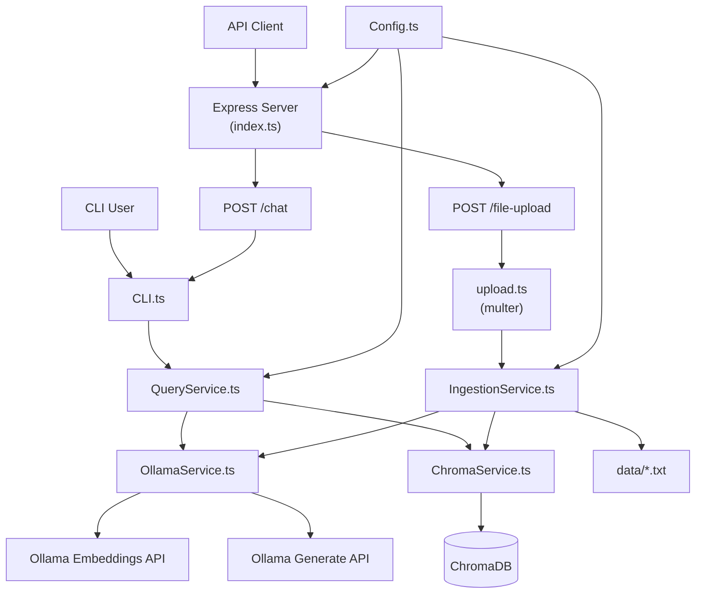

# Simple RAG

A minimal, production-ready Retrieval-Augmented Generation (RAG) application built with TypeScript, Node.js, Express, Ollama, and ChromaDB. This application provides a REST API for asking questions about your documents and uploading Txt for ingestion, using local LLMs and embeddings.

## Overview

This RAG application:
- Provides a REST API server with endpoints for chat queries and Txt file uploads
- Ingests documents (Txt) and generates embeddings using Ollama's `mxbai-embed-large` model
- Stores embeddings in ChromaDB for efficient similarity search
- Answers questions using retrieved context and Ollama's `gemma3` LLM
- Runs entirely locally - no external API calls required
- Supports both API and CLI interfaces

## Architecture



**Alternative Text Diagram** (for markdown previewers without Mermaid support):

```
┌─────────────┐     ┌─────────────┐
│ API Client  │     │  CLI User   │
└──────┬──────┘     └──────┬──────┘
       │                   │
       ▼                   ▼
┌─────────────────────────────┐
│   Express Server (index.ts)  │
└──────┬───────────────────┬───┘
       │                   │
       ▼                   ▼
┌─────────────┐     ┌─────────────┐
│ POST /chat  │     │POST /upload │
└──────┬──────┘     └──────┬──────┘
       │                   │
       │                   ▼
       │            ┌─────────────┐
       │            │ upload.ts   │
       │            │ (multer)    │
       │            └──────┬──────┘
       │                   │
       │                   ▼
       │            ┌─────────────┐
       │            │Ingestion    │
       │            │Service.ts   │
       │            └──┬──────┬───┘
       │               │      │
       │               ▼      ▼
       │          ┌─────┐ ┌─────┐
       │          │Ollama│ │Chroma│
       │          │Service│Service│
       │          └─────┘ └─────┘
       │               │
       │               ▼
       │          ┌──────────────┐
       │          │  data/*.txt  │
       │          └──────────────┘
       │
       ▼
┌─────────────┐
│   CLI.ts    │
└──────┬──────┘
       │
       ▼
┌─────────────┐
│QueryService │
└──┬──────┬───┘
   │      │
   ▼      ▼
┌─────┐ ┌─────┐
│Ollama│ │Chroma│
│Service│Service│
└──┬──┘ └─┬───┘
   │      │
   │      ▼
   │  ┌─────────┐
   │  │ChromaDB │
   │  └─────────┘
   │
   ▼
┌──────────────┐
│Ollama APIs   │
│(Embed/Gen)   │
└──────────────┘
```

### Data Flow

1. **Ingestion Phase** (via API or CLI):
   - txt files are uploaded via `POST /file-upload` endpoint (or documents loaded from `data/` directory)
   - Files are saved to `data/` directory with timestamped filenames
   - txt text is extracted and chunked into overlapping segments (1000 chars with 200 char overlap)
   - Each chunk is embedded using `mxbai-embed-large`
   - Embeddings are stored in ChromaDB with document text
   - Ingestion runs asynchronously after file upload

2. **Query Phase** (via API or CLI):
   - User sends question via `POST /chat` endpoint (or CLI input)
   - Question is embedded using the same model
   - ChromaDB performs cosine similarity search
   - Top 3 most relevant chunks are retrieved
   - Retrieved context is combined with the question
   - `gemma3` generates an answer based on the context
   - Response includes both RAG answer and simple answer (without context) for comparison

## Prerequisites

### System Requirements

- **Node.js** ≥ 18
- **TypeScript** (installed via npm)
- **Docker** (for ChromaDB)
- **Ollama** installed and running locally

### Install Ollama

Visit [ollama.ai](https://ollama.ai) to install Ollama for your platform.

### Required Models

Ensure you have the following models installed in Ollama:

```bash
# Check installed models
ollama list

# Install required models if missing
ollama pull gemma3
ollama pull mxbai-embed-large
```

## Installation

1. **Clone or navigate to the project directory**:
   ```bash
   cd simple-rag
   ```

2. **Install dependencies**:
   ```bash
   npm install
   ```

3. **Start ChromaDB** (in a separate terminal):
   ```bash
   docker run -d -p 8000:8000 --name chromadb chromadb/chroma
   ```

   To stop ChromaDB later:
   ```bash
   docker stop chromadb
   docker rm chromadb
   ```

4. **Verify Ollama is running**:
   ```bash
   ollama list
   ```

5. **Start the server**:
   ```bash
   npm start
   ```
   
   The server will start on port 3000. Make sure this port is available.

## Configuration

Configuration is managed in `src/utils/Config.ts` as a TypeScript class. The configuration interfaces are defined in `src/models/Config.ts` and exported from `src/models/index.ts`. You can override defaults using environment variables:

```typescript
// Configuration interfaces (from src/models/Config.ts)
interface OllamaConfig {
  baseUrl: string;
  embeddingModel: string;
  llmModel: string;
}

interface ChromaConfig {
  url: string;
  collectionName: string;
}

interface ChunkingConfig {
  chunkSize: number;      // characters per chunk
  chunkOverlap: number;   // overlap between chunks
}

interface RetrievalConfig {
  nResults: number;       // number of chunks to retrieve
}

// Default configuration values
{
  ollama: {
    baseUrl: "http://localhost:11434",
    embeddingModel: "mxbai-embed-large",
    llmModel: "gemma3"
  },
  chroma: {
    url: "http://localhost:8000",
    collectionName: "rag_docs"
  },
  chunking: {
    chunkSize: 1000,
    chunkOverlap: 200
  },
  retrieval: {
    nResults: 3
  }
}
```

### Environment Variables

- `OLLAMA_URL`: Override Ollama base URL (default: `http://localhost:11434`)
- `CHROMA_URL`: Override ChromaDB URL (default: `http://localhost:8000`)

## Usage

### 1. Start the Server

Start the Express server:

```bash
npm start
```

The server will start on port 3000. You should see:
```
✅ Services initialized
🚀 Server running on port 3000
```

### 2. Upload and Ingest Documents

Upload txt files via the API endpoint:

```bash
curl -X POST http://localhost:3000/file-upload \
  -F "file=@/path/to/your/document.txt"
```

The endpoint will:
- Accept txt files (max 10 MB)
- Save the file to `data/` directory with a timestamped filename
- Return immediately with upload confirmation
- Process ingestion asynchronously in the background

**Response**:
```json
{
  "message": "txt uploaded successfully. Wait a while for the ingestion to complete.",
  "fileName": "1765720613957-document.txt",
  "filePath": "data/1765720613957-document.txt",
  "size": 123456
}
```

**Note**: To force re-ingestion of existing documents, start the server with the `--force` flag:
```bash
npm start -- --force
```

### 3. Ask Questions via API

Send questions to the chat endpoint:

```bash
curl -X POST http://localhost:3000/chat \
  -H "Content-Type: application/json" \
  -d '{"question": "When was YouTube founded?"}'
```

**Response**:
```json
{
  "ragAnswer": "YouTube was founded in February 2005...",
  "simpleAnswer": "YouTube was founded in 2005..."
}
```

The response includes:
- **ragAnswer**: Generated using retrieved context from your documents
- **simpleAnswer**: Generated directly by the LLM without context retrieval

This allows you to compare the quality of RAG-enhanced answers versus direct LLM responses.

### 4. Using the CLI (Optional)

The CLI interface is still available for interactive use. After starting the server, you can access it programmatically, or modify `index.ts` to also start the CLI interface.

## API Documentation

### POST /chat

Send a question to get an answer using RAG.

**Endpoint**: `POST http://localhost:3000/chat`

**Request Headers**:
```
Content-Type: application/json
```

**Request Body**:
```json
{
  "question": "Your question here"
}
```

**Response** (200 OK):
```json
{
  "ragAnswer": "Answer generated with retrieved context...",
  "simpleAnswer": "Answer generated without context..."
}
```

**Error Responses**:
- `400 Bad Request`: Missing or empty question
  ```json
  {
    "error": "Question is required"
  }
  ```
- `503 Service Unavailable`: Server not ready yet (services still initializing)
  ```json
  {
    "error": "Server not ready yet"
  }
  ```
- `500 Internal Server Error`: Error processing the question
  ```json
  {
    "error": "Error processing the question"
  }
  ```

**Example with cURL**:
```bash
curl -X POST http://localhost:3000/chat \
  -H "Content-Type: application/json" \
  -d '{"question": "What is the main topic of the documents?"}'
```

**Example with JavaScript (fetch)**:
```javascript
const response = await fetch('http://localhost:3000/chat', {
  method: 'POST',
  headers: {
    'Content-Type': 'application/json',
  },
  body: JSON.stringify({
    question: 'What is the main topic of the documents?'
  })
});

const data = await response.json();
console.log(data.ragAnswer);
console.log(data.simpleAnswer);
```

**Example with Python (requests)**:
```python
import requests

response = requests.post(
    'http://localhost:3000/chat',
    json={'question': 'What is the main topic of the documents?'}
)

data = response.json()
print(data['ragAnswer'])
print(data['simpleAnswer'])
```

### POST /file-upload

Upload a txt file for ingestion into the RAG system.

**Endpoint**: `POST http://localhost:3000/file-upload`

**Request Headers**:
```
Content-Type: multipart/form-data
```

**Request Body** (form-data):
- `file`: txt file (required)
  - File type: txt only (`application/txt`)
  - Max size: 10 MB

**Response** (200 OK):
```json
{
  "message": "txt uploaded successfully. Wait a while for the ingestion to complete.",
  "fileName": "1765720613957-document.txt",
  "filePath": "data/1765720613957-document.txt",
  "size": 123456
}
```

**Error Responses**:
- `400 Bad Request`: Missing file or invalid file type
  ```json
  {
    "error": "txt file is required"
  }
  ```
  or
  ```json
  {
    "error": "Only txt files are allowed"
  }
  ```
- `503 Service Unavailable`: Ingestion service not ready yet
  ```json
  {
    "error": "ingestService not ready yet"
  }
  ```

**Note**: The ingestion process runs asynchronously. The endpoint returns immediately after the file is uploaded and saved. Ingestion happens in the background. Monitor server logs to see ingestion progress.

**Force Re-ingestion**: To force re-ingestion of documents (even if they already exist), start the server with the `--force` flag:
```bash
npm start -- --force
```

**Example with cURL**:
```bash
curl -X POST http://localhost:3000/file-upload \
  -F "file=@/path/to/document.txt"
```

**Example with JavaScript (FormData)**:
```javascript
const formData = new FormData();
formData.append('file', fileInput.files[0]);

const response = await fetch('http://localhost:3000/file-upload', {
  method: 'POST',
  body: formData
});

const data = await response.json();
console.log(data.message);
console.log(data.fileName);
```

**Example with Python (requests)**:
```python
import requests

with open('document.txt', 'rb') as f:
    files = {'file': ('document.txt', f, 'application/txt')}
    response = requests.post(
        'http://localhost:3000/file-upload',
        files=files
    )

data = response.json()
print(data['message'])
print(data['fileName'])
```

## Project Structure

```
simple-rag/
├── package.json          # Project configuration and dependencies
├── tsconfig.json         # TypeScript configuration
├── eslint.config.js      # ESLint configuration
├── index.ts              # Express server entry point
├── src/
│   ├── cli/
│   │   └── CLI.ts        # Interactive CLI interface
│   ├── middleware/
│   │   └── upload.ts     # Multer middleware for txt file uploads
│   ├── models/
│   │   ├── Config.ts     # Configuration interfaces
│   │   └── index.ts      # Barrel export for all models
│   ├── services/
│   │   ├── OllamaService.ts      # Ollama API wrapper (embeddings & generation)
│   │   ├── ChromaService.ts      # ChromaDB client and helpers
│   │   ├── IngestionService.ts   # Document ingestion pipeline
│   │   └── QueryService.ts       # Query processing and RAG pipeline
│   └── utils/
│       ├── Config.ts      # Centralized configuration (TypeScript class)
│       └── ResultCodes.ts # Result code constants
├── data/
│   └── *.txt             # Uploaded txt documents (timestamped filenames)
└── README.md             # This file
```

### Module Responsibilities

- **`src/models/Config.ts`**: TypeScript interfaces for configuration types (OllamaConfig, ChromaConfig, ChunkingConfig, RetrievalConfig, AppConfig)
- **`src/models/index.ts`**: Barrel export file for all model interfaces
- **`src/utils/Config.ts`**: TypeScript class providing centralized configuration management using interfaces from models
- **`src/services/OllamaService.ts`**: Handles embedding generation and LLM text generation via Ollama API
- **`src/services/ChromaService.ts`**: Manages ChromaDB connections and collection operations
- **`src/services/IngestionService.ts`**: Document loading, chunking, embedding, and storage pipeline
- **`src/services/QueryService.ts`**: Query embedding, similarity search, context assembly, and answer generation (supports both RAG and simple queries)
- **`src/cli/CLI.ts`**: Interactive CLI interface that orchestrates query services and displays results
- **`src/middleware/upload.ts`**: Multer middleware for handling txt file uploads (validates file type, size limits, saves to data directory)
- **`src/utils/ResultCodes.ts`**: Constants for result codes used throughout the application
- **`index.ts`**: Express server entry point that initializes services, sets up API routes (`/chat`, `/file-upload`), and starts the server on port 3000

## How It Works

### Chunking Strategy

Documents are split into overlapping chunks to preserve context:
- **Chunk Size**: 1000 characters
- **Overlap**: 200 characters
- This ensures important information at chunk boundaries isn't lost

### Retrieval Process

1. User question is embedded using `mxbai-embed-large`
2. ChromaDB performs cosine similarity search
3. Top 3 most relevant chunks are retrieved
4. Context is assembled with clear separators

### Prompt Engineering

The RAG prompt is designed for Gemma3:
- Clear context boundary
- Explicit instruction to use context
- Fallback for insufficient information
- Simple, direct format

## Troubleshooting

### Common Issues

| Issue | Solution |
|-------|----------|
| **"Server not ready yet"** | Wait a few seconds after starting the server for services to initialize |
| **"Port 3000 already in use"** | Change the port in `index.ts` or stop the process using port 3000 |
| **"Embedding failed"** | Ensure Ollama is running and `mxbai-embed-large` is installed |
| **"ChromaDB connection failed"** | Verify ChromaDB is running: `docker ps` |
| **"No relevant documents found"** | Upload documents via `/file-upload` endpoint or run ingestion: `npm run ingest` |
| **"Only txt files are allowed"** | Ensure you're uploading a txt file (not other formats) |
| **"txt file is required"** | Check that the form field is named `file` and the file is included in the request |
| **Empty search results** | Increase `nResults` in config or check if documents were ingested |
| **Slow embedding** | This is normal for large documents. Ingestion runs asynchronously after upload |
| **Wrong answers** | Check retrieved context quality, adjust `nResults` or chunk size |
| **File upload succeeds but no ingestion** | Check server logs for ingestion errors. Ensure Ollama and ChromaDB are running |

### Verification Steps

1. **Check the server**:
   ```bash
   curl http://localhost:3000/chat -X POST -H "Content-Type: application/json" -d '{"question":"test"}'
   ```
   Should return either a response (if ready) or `{"error":"Server not ready yet"}` (if still initializing)

2. **Check Ollama**:
   ```bash
   ollama list
   curl http://localhost:11434/api/tags
   ```

3. **Check ChromaDB**:
   ```bash
   docker ps | grep chroma
   curl http://localhost:8000/api/v1/heartbeat
   ```

4. **Check ingested documents**:
   After ingestion, check server logs for: `✓ Ingested X chunks successfully` or monitor progress messages

## Development

### Scripts

- `npm start`: Start the Express server on port 3000 (uses tsx to execute TypeScript directly)
- `npm run ingest`: Ingest documents into ChromaDB (legacy CLI ingestion)
- `npm run build`: Compile TypeScript to JavaScript (outputs to `dist/`)
- `npm run type-check`: Type check TypeScript without emitting files
- `npm run lint`: Run ESLint on TypeScript files
- `npm run lint:fix`: Run ESLint and automatically fix issues

### Adding New Documents

**Recommended Method (API)**:
1. Start the server: `npm start`
2. Upload your txt via the API:
   ```bash
   curl -X POST http://localhost:3000/file-upload -F "file=@/path/to/document.txt"
   ```
3. The file will be automatically ingested in the background

**Alternative Method (CLI)**:
1. Place your document in the `data/` directory
2. Update `src/services/IngestionService.ts` to point to your file, or modify the default path in the `ingest()` method call
3. Run `npm run ingest`

### Customizing Chunking

Modify `src/utils/Config.ts`:
- `chunkSize`: Larger = more context per chunk, fewer chunks
- `chunkOverlap`: Larger = more redundancy, better context preservation

The configuration is defined in the `Config` class constructor. You can also override values using environment variables (`OLLAMA_URL`, `CHROMA_URL`).

## Production Considerations

This is a minimal implementation. For production use, consider:

- **Batch Embedding**: Process multiple chunks in parallel
- **Streaming Responses**: Stream LLM output for better UX
- **Metadata Filtering**: Add metadata to chunks for advanced filtering
- **Re-ingestion Detection**: Track document versions to avoid unnecessary re-processing
- **Error Recovery**: Retry logic for transient failures
- **Logging**: Add structured logging for debugging
- **Performance Monitoring**: Track embedding and query times

## License

This project is provided as-is for educational and development purposes.

## Acknowledgments

- [Ollama](https://ollama.ai) for local LLM inference
- [ChromaDB](https://www.trychroma.com/) for vector storage
- Google's Gemma models
- Mixedbread AI's mxbai-embed-large embedding model

